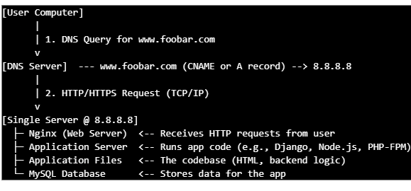

## Whiteboard Diagram

## Explanation

1. What is a server?

- A server is a computer (physical or virtual) that runs software to provide services to other computers (clients) over a network.

- fsadIn this case, it hosts our website, running all necessary software to handle web requests, run our application, and store data.

2. What is the role of the domain name?

- The domain name foobar.com is a human-readable address that users type into their browsers instead of the raw IP address. It gets translated into an IP address via DNS (Domain Name System) so the user’s browser can connect to the correct server. www.foobar.com is a subdomain of foobar.com configured to point to our server’s IP.

3. What type of DNS record is the "www" in www.foobar.com?

- Typically, "www" is a CNAME record (alias) pointing to the root domain foobar.com or directly to an IP address. Sometimes, it can also be an A record if it points directly to an IP. For this example, www.foobar.com is configured with an A record pointing to 8.8.8.8 (to our server IP).

4. What is the role of the web server (Nginx)?

- Nginx is responsible for receiving HTTP/HTTPS requests from users. It serves static files (images, CSS, JS) directly. It forwards dynamic requests to the application server (via proxy or FastCGI). It also handles connections, load balancing, caching, SSL termination, and URL rewriting.

5. What is the role of the application server?

- The application server runs the business logic of your application. It executes your backend code (e.g., PHP, Python, Node.js).

- It processes requests forwarded from Nginx, interacts with the database, and generates dynamic content (HTML pages, JSON responses). Then it sends the response back to Nginx, which forwards it to the user.

6. What is the role of the database (MySQL)?

- The database stores all persistent data: user info, posts, products, configurations, etc.

- The application server queries and updates this database as needed. MySQL is a popular relational database management system (RDBMS).

7. What is the server using to communicate with the user's computer?

- Communication happens over the Internet Protocol (IP) and Transport Control Protocol (TCP) using the HTTP or HTTPS protocols.

- The browser sends an HTTP/HTTPS request to the IP address resolved by DNS. The server replies with HTTP/HTTPS responses HTTPS adds encryption via TLS/SSL for security.

## Limitations With this infrastructure:

1. Single Point of Failure (SPOF): The entire website depends on one server. If the server crashes, all services (web, app, database) go down, and the website becomes unreachable.

2. Downtime During Maintenance: To deploy new code or perform maintenance, the server or services like Nginx need to be restarted. This causes downtime, making the website temporarily inaccessible.

3. No Scalability: This setup cannot handle a large number of concurrent users efficiently. With increasing traffic, the single server’s CPU, memory, and network bandwidth will bottleneck. You cannot add more servers easily for load balancing or failover.
