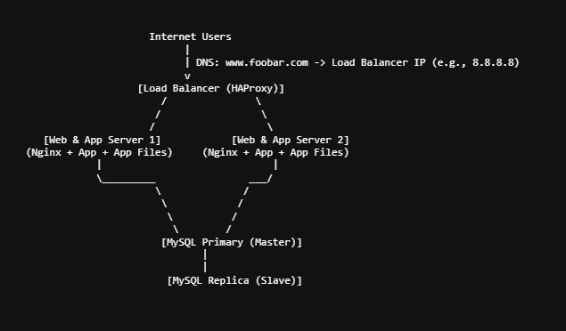

## Whiteboard Diagram

Components & Their Roles
1. Load Balancer (HAProxy) 
- Why add? To distribute incoming user traffic evenly across multiple application servers to improve performance, availability, and fault tolerance. Receives all requests first and forwards them to one of the application servers based on a distribution algorithm. It enables horizontal scaling by adding/removing servers without downtime.

- The load balancer uses Round Robin distribution algorithm: It sends each incoming request to the next server in the list, cycling through all available servers evenly.

  - Example: Request 1 → Server 1, Request 2 → Server 2, Request 3 → Server 1, etc.

- Active-Active vs Active-Passive load balancer setups
  - Active-Active:

- Multiple load balancers run simultaneously, both actively handling traffic. It provides high availability and load distribution among load balancers.It requires synchronization/heartbeat between load balancers.

  - Active-Passive:

 - One load balancer actively handles traffic, while another is on standby (passive). If active fails, passive takes over. It easier to set up but only one load balancer serves traffic at a time

2. Two Servers for Web & Application
Previously, we had one server doing everything. Now, we split into two servers that each host both the web server (Nginx) and the application server plus our code base. This redundancy allows continued service if one server fails.

3. Database Primary-Replica Setup
A Primary (Master) MySQL server handles all write operations. One or more Replica (Slave) servers replicate data asynchronously from the primary and handle read queries. This offloads read traffic from the primary and improves read scalability and data availability.

## Limitations

- Single Points of Failure (SPOF): 
  - Load Balancer: If the HAProxy server fails, the entire system becomes unreachable .

  - Primary Database: If the Primary MySQL server fails, write operations stop. 

- Security Issues
  - No firewall to protect servers from unauthorized access.

  - No HTTPS means data between user and server is not encrypted, vulnerable to man-in-the-middle attacks.

  - No SSL/TLS termination at the load balancer or web server.

- No Monitoring
  - Without monitoring tools, it’s impossible to know the health or performance of the servers and services. Failures or overloads might go unnoticed, causing prolonged downtime or poor user experience.
