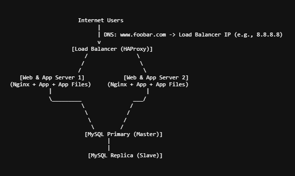

## diagram

1. 3 Firewalls
- One firewall at the network edge to filter all incoming/outgoing traffic from the internet.

- One firewall on each application server to protect individual servers from lateral attacks.

- One firewall for the database server.

- Purpose: Firewalls restrict unauthorized access, only allowing legitimate traffic through defined ports and protocols, protecting the servers from attacks and reducing the attack surface.

2. 1 SSL Certificate (HTTPS for www.foobar.com)
- Enables encrypted traffic between users and servers.

- Protects sensitive data like login credentials, personal info, and API calls from eavesdropping and man-in-the-middle attacks.

- Establishes trust and authenticity by verifying the server’s identity.

3. 3 Monitoring Clients (Data Collectors)
- Installed on each server (2 app servers + 1 database server).

- Collect metrics like CPU, memory, disk, network, logs, and application-specific data.

- Send this data to a centralized monitoring service (e.g., Sumo Logic, Datadog, Prometheus).

## Limitations 

1. Why is terminating SSL at the load balancer level an issue?
- SSL termination at the load balancer means traffic from the load balancer to the backend servers is unencrypted, exposing sensitive data inside your private network. To maintain end-to-end encryption, you must re-encrypt traffic between load balancer and backend (SSL passthrough or SSL re-encryption). If re-encryption is not done, insider threats or compromised internal network segments can intercept data.

2. Why having only one MySQL server capable of accepting writes is an issue?
- The single writable MySQL Primary server is a single point of failure for writes. If it goes down, no new data can be written, leading to service disruption. To mitigate, use database replication with automatic failover or clustering solutions (like MySQL Group Replication or Galera Cluster).

3. Why having servers with all the same components (database, web server, application server) might be a problem?
If every server runs all components, resource contention can occur: heavy DB operations may slow down the app or web server.

- It’s harder to scale components independently (e.g., add more app servers without duplicating DB). Troubleshooting and optimizing performance become complicated. Security risk increases if a compromised server has access to all layers.
