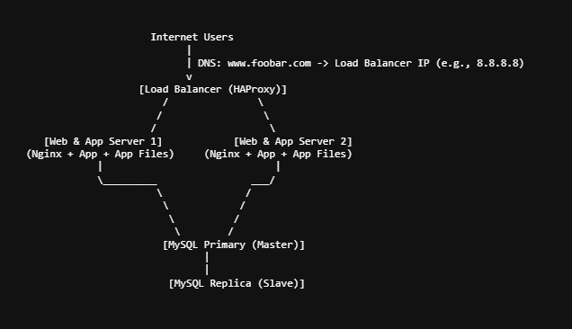

## diagram

## Additional Elements & Reasons
1. One extra server added
- Total servers: 4
- Each server dedicated to a specific layer:

  - Web server

  - Application server

  - Database server

  - Load balancer cluster (2 servers)

2. Load balancer cluster with HAProxy
Why add second load balancer?
- To avoid single point of failure (SPOF) at the load balancing layer. HAProxy servers configured in an Active-Active cluster:
  - Both actively handle incoming traffic.

  - Use health checks and synchronization to share state and balance traffic evenly.

  - If one fails, the other continues handling traffic without downtime.

3. Split components on dedicated servers
- Web Server (Nginx only):

  - Serves static content efficiently.

  - Handles SSL termination (optional depending on design).

- Application Server:

  - Runs backend code, business logic, processes requests forwarded from web server.

  - Allows independent scaling and resource allocation.

- Database Server (MySQL):

  - Handles all data storage and queries.

  - Isolated for security, performance, and easier management.

